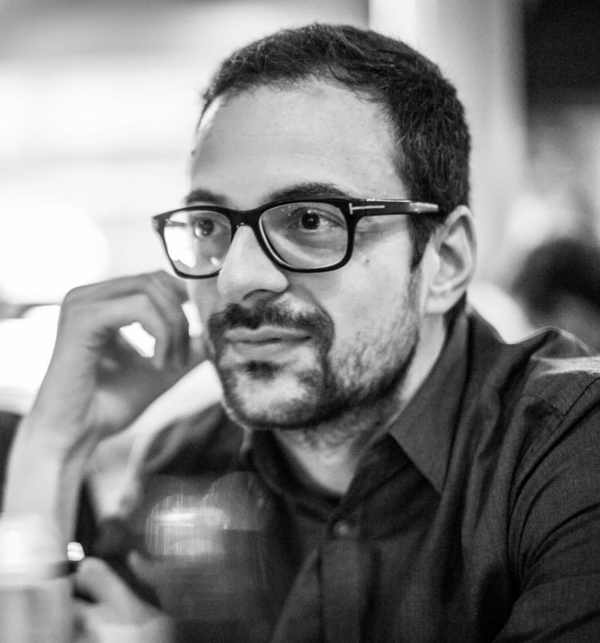

---
# Feel free to add content and custom Front Matter to this file.
# To modify the layout, see https://jekyllrb.com/docs/themes/#overriding-theme-defaults

layout: home
---

 I am a postdoctoral researcher at the Knowledge Representation & Reasoning Group of the Vrije Universiteit Amsterdam. I investigate the integration of and access to diverse types of knowledge, with a special interest in Digital Humanities data and workflows. I am interested in knowledge graphs, Linked Data, Web query languages, and APIs.
